<div align="center">
  <a href="#install">
    <picture>
      <source media="(prefers-color-scheme: light)" srcset="assets/banner-light.svg">
      
    </picture>
  </a>
</div>


---

## Install

```bash
claude plugin install https://github.com/devgard-labs/kenaz
```

Requires [Claude Code](https://claude.ai/code). Uses the Claude model you already have — no extra API key, no account, no cost.

## Usage

```bash
/kenaz git-helper          # audit by plugin name
/kenaz ./my-local-plugin   # audit a local directory
/kenaz self                # verify the auditor itself hasn't been tampered with
```

**CI mode** (exits `1` if `DO_NOT_INSTALL`, `0` otherwise):
```bash
bash scripts/ci-audit.sh /path/to/plugin
```

### Example output

```
ᚲ Kenaz — auditing git-helper
━━━━━━━━━━━━━━━━━━━━━━━━━━━━━━━━━━━━
Scanning 4 files...

PA-001 exfiltration .............. PASS
PA-004 sensitive-read ............ PASS
PA-015 prompt-injection .......... PASS
PA-022 shell-injection ........... WARN  git-helper.js:47 — template literal
PA-019 hook-injection ............ PASS

━━━━━━━━━━━━━━━━━━━━━━━━━━━━━━━━━━━━
Verdict  REVIEW
Score    88/100
Cache    saved  (sha256: a3f7c2...)

Review flagged file before installing.
```

---

## What it detects

| Category | Rules | Examples |
|---|---|---|
| **Exfiltration** | PA-001..PA-003, PA-018 | HTTP to unknown URLs, `process.env` leak, MCP params interception |
| **Sensitive read** | PA-004..PA-006 | `.env` access, `~/.ssh` reads, out-of-scope file access |
| **Hidden execution** | PA-007..PA-010, PA-019, PA-022 | `eval()`, shell exec, lifecycle scripts, hook injection |
| **Obfuscation** | PA-011, PA-012, PA-017 | Minified code, base64 payloads, `String.fromCharCode` |
| **Prompt injection** | PA-015..PA-016 | `.md` instruction hijacking, hidden HTML comments |
| **Supply chain** | PA-020..PA-021 | Unversioned `npx -y`, wildcard deps, private registries |

## Verdicts

| Verdict | Meaning | Action |
|---|---|---|
| `SAFE` | Only `.md` instructions, no executable code | ✅ Install |
| `SAFE_WITH_CODE` | Has code, fully transparent and justified | ✅ Install |
| `REVIEW` | Ambiguous patterns — human review needed | ⚠️ Review flagged files |
| `DO_NOT_INSTALL` | Confirmed exfiltration, injection, or obfuscation | ❌ Reject |

---

## How it compares

| Feature | **Kenaz** | Snyk mcp-scan | AgentShield | AgentSeal | Semgrep |
|---|:---:|:---:|:---:|:---:|:---:|
| **Price** | **Free** | Snyk account | $19/mo | $19/mo | $30/mo |
| **100% offline** | ✅ | ❌ | ❌ | ❌ | ❌ |
| **Claude Code native** | ✅ | ❌ | ❌ | ❌ | ❌ |
| **Prompt injection (.md scan)** | ✅ | ❌ | Partial | ❌ | ❌ |
| **MCP params exfiltration** | ✅ | Partial | ❌ | ❌ | ❌ |
| **Hook injection detection** | ✅ | ❌ | ❌ | ❌ | ❌ |
| **Base64/charcode deobfuscation** | ✅ | Partial | ❌ | ❌ | Partial |
| **SHA-256 audit cache** | ✅ | ❌ | ❌ | ✅ | ❌ |
| **CI mode (exit code)** | ✅ | ✅ | ❌ | ✅ | ✅ |
| **OWASP Agentic Top 10 mapping** | ✅ | Partial | ❌ | ❌ | ❌ |
| **Self-test** | ✅ | ❌ | ❌ | ❌ | ❌ |
| **Zero npm dependencies** | ✅ | ❌ | ❌ | ❌ | ❌ |

---

## Features

**SHA-256 cache** — Already audited this plugin? If the content hasn't changed, re-auditing is instant. Cache stored at `~/.claude/audit-cache/`.

**Deobfuscation** — Decodes `base64` payloads and `String.fromCharCode()` sequences before emitting a verdict. You see what the code actually does.

**CI mode** — `ci-audit.sh` exits `1` on `DO_NOT_INSTALL`. Drop it before any plugin install step in your pipeline.

**Self-test** — `/kenaz self` audits the auditor itself. Detects tampering after updates.

---

## Rules catalog

Full rules with detection patterns, malicious/benign examples, and false-positive guidance:
→ [`rules/PA-RULES.md`](rules/PA-RULES.md)

## Test suite

```bash
bash tests/validate-golden-set.sh --verbose
# 44 checks, 0 failures
```

6 test plugins (safe + ambiguous). The malicious fixtures are excluded from the public repo — they contain bypass patterns that would make it easier to evade detection. No LLM required to run the suite.

---

## Why this exists

The Claude Code plugin ecosystem is growing fast. In April 2026:
- **CVE-2025-6514** demonstrated real MCP server exfiltration in production
- **36.7%** of MCP servers tested had SSRF vulnerabilities (research, Q1 2026)
- Snyk acquired Invariant Labs specifically for MCP security
- Lakera was acquired for **$300M** — agent security is real infrastructure now

Most tools are cloud-based and expensive. Kenaz is the free, offline, Claude-native option. No data leaves your machine.

---

## Contributing

Bug reports, false positive reports, and rule suggestions welcome — see [CONTRIBUTING](#) and the [issue templates](.github/ISSUE_TEMPLATE/).

Security issues: see [SECURITY.md](.github/SECURITY.md).

## License

MIT — see [LICENSE](LICENSE)
